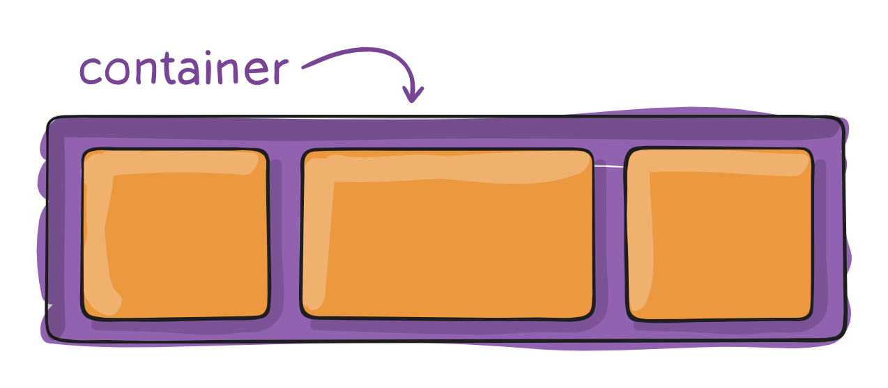
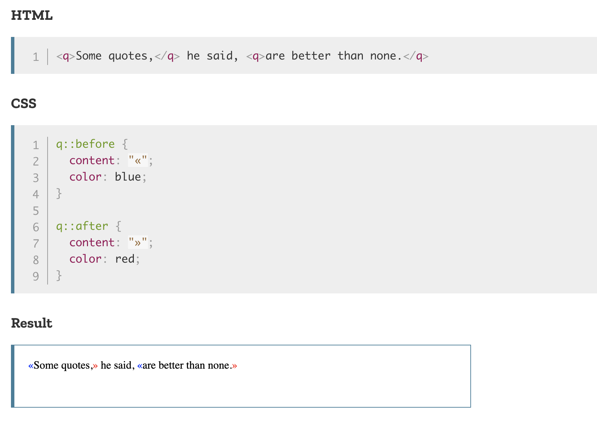
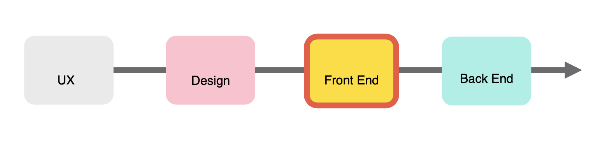

# Front-end web development 
--

## Links:

[Practice](https://repl.it/@melodyserra/practice)

[Review](https://repl.it/@melodyserra/review)

[Floats and Flexbox](https://repl.it/@melodyserra/Floats-and-Flexbox)

[Media Queries](https://repl.it/@melodyserra/mediaqueries)

[Media Queries 2](https://repl.it/@melodyserra/youdomediaqueries)

[Type](https://repl.it/@melodyserra/type)

[Final Lab](https://repl.it/@melodyserra/labday1)

--
# Review

## What is the box model?
- One can say that every element on the page is wrapped by a box. 
- That box takes up a specific amount of space by default.
- The model allows us to define space around and between elements. 
- It consists of: margins, borders, padding, and the actual content. 
	- **Content** - The content of the box, where text and images appear
	- **Padding** - Clears an area around the content
	- **Border** - A border that goes around the padding and content
	- **Margin** - Clears an area outside the border


## CSS positioning
- There are four main types of positioning that you will see most often - static, relative, absolute, and fixed.
- Static positioning is what all elements have by default.
- Relative and absolute work together - elements can be positioned absolutely relative to their container.
- Fixed position elements are essentially absolute relative to the window no matter where they are in the DOM. A.K.A. the window is always the relative parent.

## Floats
- Floating elements allows us to create a nearly unlimited number of layouts using all types of block elements.
- [Floating](https://developer.mozilla.org/en-US/docs/Web/CSS/float) an element essentially removes it from the standard "flow" and places it to the left or right side of its container.
- Elements can have fixed width, which will wrap underneath each other if the container is smaller than the combined widths.
- You can also used percentage width, which will have the columns respond to the screen size.
- You can tell already that the calculations can get out of hand really fast...
- [Clear-fix](http://learnlayout.com/clearfix.html) forces content after the floats or the container containing the floats to render below it. 

## Flexbox vs. floats



- The container is called the ***flex container***.
- The elements inside the container are called the ***flex items***.

HTML

```html
<div>
	<section>Hello</section>
	<section>Hello 2</section>
	<section>Hello 3</section>
</div>

```

CSS 

```css
div {
	display: flex;
	justify-content: space-between;
}

```

## The grid layout
- Most modern layouts operate on a standard 12-column grid system.
- If you break down any of the websites you know and love you will notice many variations on the 12 column grid.
- Each column in the grid can contain nested grids itself.
- If you want a larger box, you need to have a greater column offset.
- Here is a good pictorial to help you break it down:


- And [here](https://developer.mozilla.org/en-US/docs/Web/CSS/CSS_Grid_Layout) is a great resource to introduce you to the grid layout. 

## Flexbox vs. grid system

- CSS Grid is a newer technology. 
- Flexbox is used for one-dimentional layouts and Grid Layout is used for two-dimentional layouts.
- A simple question to ask yourself when deciding between grid or flexbox is:
	- do I only need to control the layout by row or column – use a flexbox
	- do I need to control the layout by row and column – use a grid 

## Twitter Bootstrap
- Bootstrap is a front-end framework that incorporates a grid system, UI components, JavaScript widgets and more.
- Let's take a look at the documentation: [http://getbootstrap.com](http://getbootstrap.com/).
- The framework consists of one main CSS file, an optional theme CSS file, and a main JS file.
- Bootstrap requires jQuery to work, which is a JavaScript framework.

## Using Bootstrap
- To use Bootstrap you have to include the three required files.
- Bootstrap files can be linked via the CDN provided, or downloaded locally onto the computer.
- Remember to place your reference to the jQuery library above your reference to the Bootstrap JS code.

## Bootstrap Columns
- Columns are written in this format as a class attribute: col-(breakpoint)-(offset).
- An example of a three-column layout may be to use the class col-sm-4.
- All columns should be wrapped into an element with a class of row.
- So the complete three-column layout may look something like this:

```html
<div class="row">
	<div class="col-sm-4">
		Content Here
	</div>
	<div class="col-sm-4">
		Content Here
	</div>
	<div class="col-sm-4">
		Content Here
	</div>
</div>
```

## Breakpoints
- The way that Bootstrap works is to dynamically reduce column size according to the window size.
- To be mobile-friendly, the columns will break into a stack layout after a minimum width is detected.
- The breakpoints you can select in your columns control at which point this happens.
- Check out their documentation [here](http://getbootstrap.com/css/#grid) to see what these breakpoints are in terms of size.

## CSS3 Media Queries
- Media queries allow you to apply and remove CSS styling based on the screen dimensions.
- This is important to create truly mobile-friendly layouts.
- To use it you have to specify screen resolution thresholds.
- Let's try an example where we want to show a div where the screen size is larger than 700 pixels:

HTML

```html
<div id="my-div"></div>
```

CSS

```css
@media(min-width: 700px) {
	#my-div {
		width:400px;
		height:400px;
		border:#000 1px solid;
	}
}
```

- Now where the screen size is below 700 pixels:

CSS

```css
@media(max-width: 700px) {
	#my-div {
		width:400px;
		height:400px;
		border:#000 1px solid;
	}
}
```

- You can also combine these values to select a range:

```css
@media(min-width: 700px) and (max-width: 900px) {
	#my-div {
		width:400px;
		height:400px;
		border:#000 1px solid;
	}
}
```

- Good news! Bootstrap does this for you!

## UI Elements
- Bootstrap wraps in a myriad of great UI elements that you can drop in anywhere on your site.
- With Bootstrap you can make really pretty things quickly.
- Let's look at some [examples](http://getbootstrap.com/components/).

## Review lab 

## Pseudo-class in CSS
- Keyword that is added to allow you to control a specific part of the element.
	- Can you think of an example? Can you demo it for us?
- `::before` often used to add cosmetic content to an element with the content property.

```
/* Add a heart before links */
a::before {
  content: "♥";
}
```
- `::after` is similar and often used with `::before`. 



## CSS buttons
- Many of the standard CSS properties will be applied to styling buttons. 
	- e.g. **background color**, **border**, **font-size**, **width**, **height**, **padding**
- An additional CSS property that will help you make pretty buttons:
	- **border-radius**
- Use the pseudo-class **:hover** to change the style of the button when you move the mouse over it (good place to use transitions).
- Let's play with this [example](https://www.w3schools.com/css/tryit.asp?filename=trycss_buttons_hover).

## iFrames
- Inline frame. 
- Used to display a webpage within a webpage. 

```
<iframe src="url" height="200" width="300"></iframe>

```

- By default an iFrame has a border around it, any guesses on how to remove it?
- Every <iframe> in a page requires increased memory and other computing resources. 
- You can read more about specific iFrame attributes [here](https://developer.mozilla.org/en-US/docs/Web/HTML/Element/iframe).

## Cross-browser
- It's difficult to predict which browser our users will be using, so it's important to check compatibility on all browsers. 
- Most packaging tools like **webpack** will account for cross-browser compatibility for us, however as front-end engineers there are a few things we could be doing. 
- There are a few CSS3 properties where we know there will be variation accross browsers so we could use vendor prefixes to account for this inconsistencies. Here is a good [resource](https://www.monitis.com/blog/5-css-techniques-for-better-cross-browser-compatibility/). 
- There are also libraries like **reset** that will help eleminate inconsistensies accross browsers. You essentially import the [CSS file](https://gist.github.com/DavidWells/18e73022e723037a50d6) and it will remove things like margins for example which will vary by browser. 
- Additionally, an [autoprefixer](https://css-tricks.com/autoprefixer/) will apply prefixes for you so you do not have to. 

## Typography and type-setting
- Similar to math or science, in web development when you're dealing with size there are different units. 
- Rem and em are relative units, px is not. 
- An em is a unit of typography, equal to the currently specified point-size. 
- Remember: when em units are used on font-size, the size is relative to the font-size of the parent. When used on other properties, it's relative to the font-size of the element itself.
```
h1 { font-size: 20px } /* 1em = 20px */
p { font-size: 16px } /* 1em = 16px */
```

```
.parent {
  font-size: 18px;
}
.child {
  font-size: 1.5em; /* 1.5em = 27px */
  padding: 2em 1em; /* 2em = 54px 1em = 27px */
}
```
- Rem stands for root em. It is a unit of typography equal to the root font-size. This means 1rem is always equal to the font-size defined in <html>.

```
<div class="parent">
  I'm 15px
  <div class="child-rem">
  I'm 32px, as expected
    <div class="child-rem">
    I'm 32px, yep!
      <div class="child-rem">
      I'm 32px, like clockwork!
      </div>
    </div>
  </div>
</div>
```
```
.html {
  font-size: 16px;
}
.parent {
  font-size: 15px;
}
.child-rem {
  font-size: 2rem;
}
```
- A lot of CSS properties take percentage values: width, line-height, and font-size, among others.
- [**line-height**](https://www.w3schools.com/cssref/tryit.asp?filename=trycss_line-height) is a property that specifies the height of a line. Only positive values are allowed. 
- Let's briefly discuss special characters.
- The **text-indent** property specifies the indentation of the first line in a text-block. Negative values are allowed. 
- [**drop-caps**](https://htmldog.com/techniques/dropcaps/) allow you to make the first letter of a paragraph stand out. This is often used in blogs or news articles. 
- Let's now briefly discuss some [**text-effects**](https://www.w3schools.com/css/css3_text_effects.asp).


## UX Design
- The role of a front-end engineer is to turn the designs made into code and assets. They are creating the visual interface for a wesbite - everything the user sees and interacts with. Other things they have to think about are: accessibility, performance, cross-browser and cross-device functionality. 
- Let's talk about what comes before the front-end engineers start building. 



## Lab


