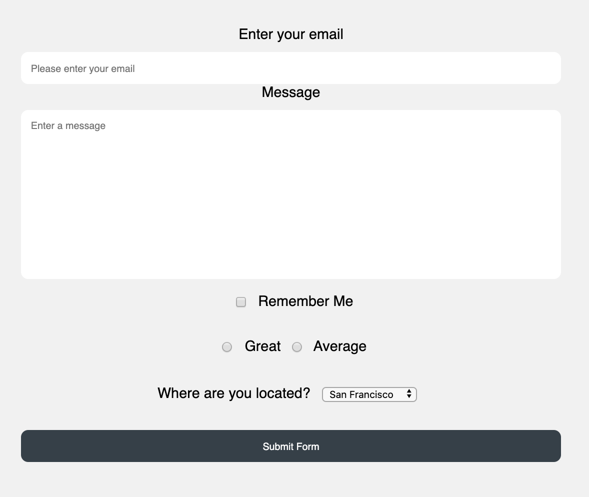

# # Front-end web development-Day 2
--

## Links:

[Practice](https://repl.it/@melodyserra/practice)

[Tables](https://repl.it/@melodyserra/Tables)

[Email](https://repl.it/@melodyserra/email)

[Forms](https://repl.it/@melodyserra/forms)

[Traffic Light](https://repl.it/@melodyserra/trafficLight)

[Color Switcher](https://repl.it/@melodyserra/color)

[jQuery Intro](https://repl.it/@melodyserra/jQueryintro)

[Final Lab](https://repl.it/@melodyserra/labday2)

## Email templates 
- Using tables can allow for nesting (tables within tables).
- Gives you control over where you position things. 


```
<table style="width:100%">
  <tr>
    <th>First name</th>
    <th>Last name</th>
    <th>Age</th>
  </tr>
  <tr>
    <td>Sarah</td>
    <td>Smith</td>
    <td>30</td>
  </tr>
  <tr>
    <td>John</td>
    <td>Jackson</td>
    <td>34</td>
  </tr>
</table>
```

```
table, th, td {
  border: 1px solid black;
  border-collapse: collapse;
}
```

# Forms 
- Forms are the primary means to get data from the front end to various back end systems.
- Typically when a form is submitted, the data is sent to a script on the back end that does something with it and then redirects the user to another page or back to where they were before.
- Forms generally have three pieces of information that accompany any transmission:
	- Where to send the data
	- How to send it
	- What is being sent

## The `form` tag
- The form tag is used to enclose the form fields you want to send to the backend, as well as to contain information about where the data is going.
- Here is what a simple login `form` tag could look like:

```
<form action="/login" method="POST"></form>
```

## The `input` tag
- The `input` tag provides a box for the user to enter information.
- With HTML5 we have many different input types available to us. Here are a few common ones:
	- `<input type="text" />`
	- `<input type="password" />`
	- `<input type="email" />`
	- `<input type="tel" />`
- While some of them may not look any different on the computer, they will open up different keyboard on a mobile device.
- Let's take a look at a demonstration using an iPhone.

## The `select` and `option` tags
- The `select` and `option` tags go together to create dropdown lists.
- They can be hard-coded, but they are often generated dynamically via the back end service.
- Let's take a look at the syntax:

```
<select>
	<option value="CA">California</option>
	<option value="NY">New York</option>
</select>
```

## Checkboxes and radios
- Checkboxes and radios are used to select pre-defined values from a list.
- Here are a couple examples:

```
<input type="checkbox" name="tos-agree" value="accept" />
```
and

```
<input type="radio" name="accept" value="accept" />
<input type="radio" name="accept" value="decline" />
```
- Both of these input types have hard-coded values because they are pre-defined.

## Field `name` attributes
- Each field that you want to use to accept and transmit data will have to have a `name` attribute.
- The name attribute is essentially the parameter that identifies that piece of information to the server on the back end.
- Adding names is simple:

```
<input type="text" name="username" />
```
or

```
<select name="state">
	<option value="">Choose State</option>
	<option value="CA">California</option>
	<option value="NY">New York</option>
</select>
```

## Styling form fields
- Form fields have some default rendering associated with them, but it is always a good idea to overwrite that with some custom styling.
- Let's take a look at how we can apply some basic styling to create a nice uniform feel.
- Bootstrap also provides us a class called `form-control` that takes care of standardizing all of our form fields for us.

## Form exercise
- For this exercise we will practice using form tags to create a simple form.
- Below is a mockup of what we want to accomplish. Try to replicate the same basic design.
- Pay attention to which input field types to use.



## Simple form validation
- This method of reading form data with JavaScript is most commonly used for form validation.
- One of the simplest checks we can make is that all fields have been filled out and not left blank.
- Here's an example using a for-in loop to check the form for blank submissions:

```js
for (field in formInfo) {
	if (formInfo[field] === "") {
		alert("Please fill in all fields.");
		return false;
	}
}
```
- This loop with go through the object and check for blank entries.
- If a blank is found, and alert will be triggered and the parent function will return false. This will prevent any further action from taking place.
- When applying validation on a form using JS its common practice to set the `type` attribute of the submit button to "button". This will make sure it doesn't submit the form without going through the validation first.

# Introduction to JavaScript

## Linking JS with HTML
- JavaScript enables interaction with the page.
- In order to run external JS you need to link it to the HTML. This usually goes before the closing `body` tag:

```js
<script src="js/script.js"></script>
```

## What is JavaScript?
- JavaScript is a programming language that runs on the front-end (the client), and also the back-end (the server).
- It is based on ECMAScript, and follows its patterns. Check out [this link](http://en.wikipedia.org/wiki/ECMAScript) for more information.
- HTML and CSS are sort of like style and layout guides that tell the browser what to render to the user. JavaScript is a list of detailed operations that can respond to events and change things on the page.

## What can JavaScript do?
- JavaScript powers web interactivity. It is responsible for adding functionality to your web interfaces.
- Here is a short list of common JavaScript functionality:
	- Attach events to DOM elements, such as click or mouseover events.
	- Light animations such as fades or slides.
	- AJAX to pull data from the server after the initial page load.
	- Advanced vector drawings and animations with HTML5 canvas.
	- Hybrid mobile apps.
	- And much more.

## JavaScript data types

#### Strings

Strings are simply pieces of text denoted by quotation marks. An example may be:

```
"Hello World!"
```

#### Integers

Integers are simply whole numbers without any decimals. An example may be `45` or `2`.

#### Variables

Variables allow us to represent information by a specific set of characters. Therefore we do not have to keep typing the same code over and over:

```js
var saying = "Hello World!";

alert(saying);
```

#### Arrays

Arrays allow us to be able to store a set of data in one place. Let's say we want to look up information about a particular user. An array of a user's information may look like this:

```js
var student = ["Max", 27, "San Francisco"];
```

We can access pieces of this information through the index value:

- First Name: `student[0]`
- Age: `student[1]`


## Control flow in JavaScript
- Often times you want to make sure certain blocks of code get activated under specific circumstances.
- Control flow structures help you specify when you want blocks of code to run based on a number of true/false conditions.

## Conditionals

- Standard `if, else` blocks
- Slightly more advanced `if, else if, else` blocks

## Comparison operators

- AND `&&`, OR `||`
- `>`, `<`, `>=`, `<=`

## Control flow exercise: The Marathon Runner
- Create a prompt that asks the user what their best marathon time was.
- If their time was between 4 to 5 hours, alert the user that their time was average.
- if the time was between 2 to 4 hours, alert the user that their time was excellent.
- If the time was greater than 5 hours, alert the user that they need to speed up!

#### Functions

Functions allow us to write code once and call it a number of times throughout our program. This helps us keep code maintainable and also helps to make it dynamic.

```js
function sayHello() {
	alert("Hello World!");
}
```

We can also pass in data to perform a dynamic operation:

```js
function addTwo(num1, num2) {
	alert(num1 + num2);
}
```

When using JavaScript to perform operations, you may need to `return` the data outside of the function. You can do this like so:

```js
function addTwo(num1, num2) {
	return num1 + num2;
}
```

To call a function after it is written, you refer to it by its name:

```js
sayHello();

addTwo(1, 2);
```

# Introduction to jQuery

## What is jQuery?

jQuery is a cross-browser JavaScript library designed to simplify the client-side scripting of HTML.

It helps us out with:

- DOM traversal
- CSS manipulation through style attributes
- Event handling
- Animation
- And much more

## How to use jQuery

- jQuery is available via CDN at code.jquery.com
- You can also download the library and serve it locally
- jQuery by itself is a library of functions. The team has also built additional tools that help us with a variety of things:
- jQuery UI: A UI tool that adds features such as additional easings, a datepicker, modals, effects, and more.
- jQuery Mobile: A mobile-optimized framework that allows you to create HTML5 mobile applications that look and act pretty real.

## jQuery selectors

- The Sizzle selector engine wrapped into jQuery is a powerful tool to help us with manipulating DOM elements.
- The syntax is very similar to CSS:
```js
$("#main-heading")

```

- Here the $ sign represents the jQuery library.


## jQuery actions

- Actions almost always follow selectors.
- Actions are jQuery functions that perform an operation on the element(s) selected.
- The format is as follows:
```js
$("my-selector").action(options);
```

## DOM manipulation

- The DOM manipulation functions in jQuery help you accomplish some pretty neat things.
- Here are a few common manipulations you will likely see:

On the fly CSS manipulations:
```js
$("my-selector").css("property", "value");
```

On the fly HTML manipulations:
```js
$("my-selector").html("New HTML inside here");
````
Altering CSS class attributes:
```js
$("my-selector").addClass("new class");

$("my-selector").removeClass("class");

$("my-selector").toggleClass("class");
```

## Event handling

- Event handling is done very smoothly with jQuery.
- There are a few different ways it can be performed, each having their use cases.
- Let's say we have a button and want to attach an event:

HTML
```html
<button id="my-button">Click Me!</button>
```
jQuery

- This is what I like to call the shortcut method.
- It has the limitation of not working when the DOM element doesn't already exist (think AJAX loading in dynamic content).

```js
$("#my-button").click(function() {
  //Your code here
});
```

- You can also bind events using .on
- This is also limited to elements that already exist, but it is a better approach.

```js
$("#my-button").on("click", function() {
  //Your code here
});
```
- Lastly, you can account for dynamic elements through binding the event to the document itself.
- This also happens to be the most performant if you look at benchmark tests.
```js
$(document).on("click", "#my-button", function() {
  //Your code here
});
```
- Here is a list of the most common events you are likely to see:
  - Click
  - Keyup
  - Keydown
  - Mouseenter
  - Mouseleave
  - Dblclick
  - Change

## Simple validation exercise
- In this exercise you will add simple validation to your form.
